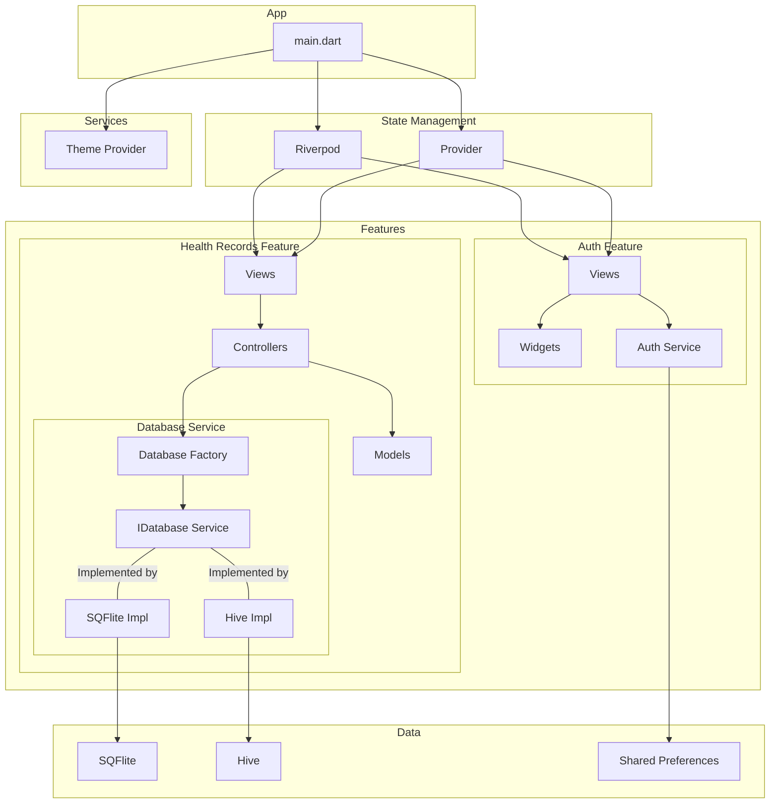

# Architecture

## Architecture Overview

The application follows a **feature-based architecture**. Each feature is a self-contained unit with its own UI, logic, and data access. This approach promotes modularity and scalability.

### Core Components

*   **`main.dart`**: The entry point of the application. It sets up the initial environment and providers.
*   **State Management**: The application uses both `flutter_riverpod` and `provider` for state management. This is unusual, and it might be beneficial to consolidate to a single state management solution.
*   **Services**:
    *   **`Theme Provider`**: A global service for managing the application's theme.
    *   **`Auth Service`**: A service within the `auth` feature to handle user authentication. It likely uses `shared_preferences` for storing session data.
    *   **`Database Service`**: A service within the `health_records` feature that abstracts the database implementation. It uses a **Factory Pattern** to provide either a `sqflite` or `hive` implementation of the `IDatabaseService` interface.
*   **Features**:
    *   **`Auth`**: Handles user authentication. It's composed of:
        *   **`Views`**: UI screens for authentication (e.g., login, registration).
        *   **`Widgets`**: Reusable UI components for the auth feature.
        *   **`Auth Service`**: The service responsible for authentication logic.
    *   **`Health Records`**: Manages user health records. It's composed of:
        *   **`Views`**: UI screens for displaying and managing health records.
        *   **`Controllers`**: Contains the business logic for the feature.
        *   **`Models`**: Data structures representing health records.
        *   **`Database Service`**: The service for data persistence.
*   **Data Layer**:
    *   **`SQFlite`**: A relational database for structured data.
    *   **`Hive`**: A NoSQL key-value database for semi-structured data.
    *   **`Shared Preferences`**: For storing simple key-value data, like session tokens.

### Data Flow

1.  The UI (`Views`) is built using `Widgets`.
2.  User interactions in the `Views` trigger methods in the `Controllers` (in `health_records`) or `Services` (in `auth`).
3.  The `Controllers`/`Services` execute the business logic.
4.  For data persistence, the `Database Service` in `health_records` uses the `Database Factory` to get the appropriate database implementation (`SQFlite` or `Hive`).
5.  The `Models` define the structure of the data.
6.  The state management solutions (`Riverpod` and `Provider`) are used to update the UI when the data changes.

### Nested `app` Directory

There is a nested `app` directory that contains a default Flutter counter application. This directory seems to be unused and can likely be safely removed to avoid confusion.
