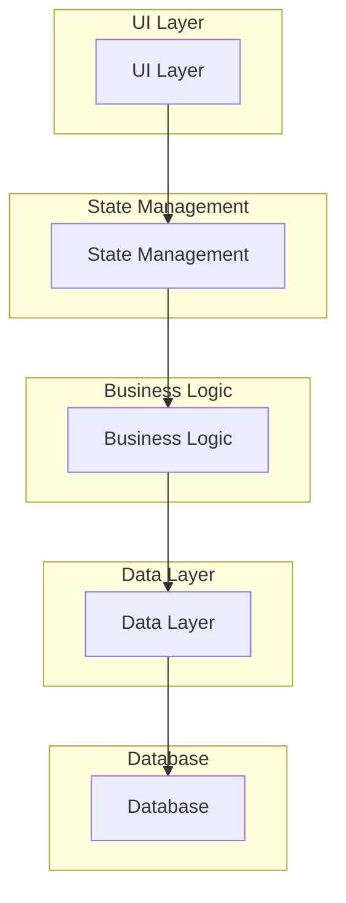
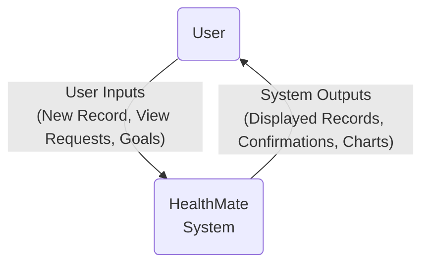
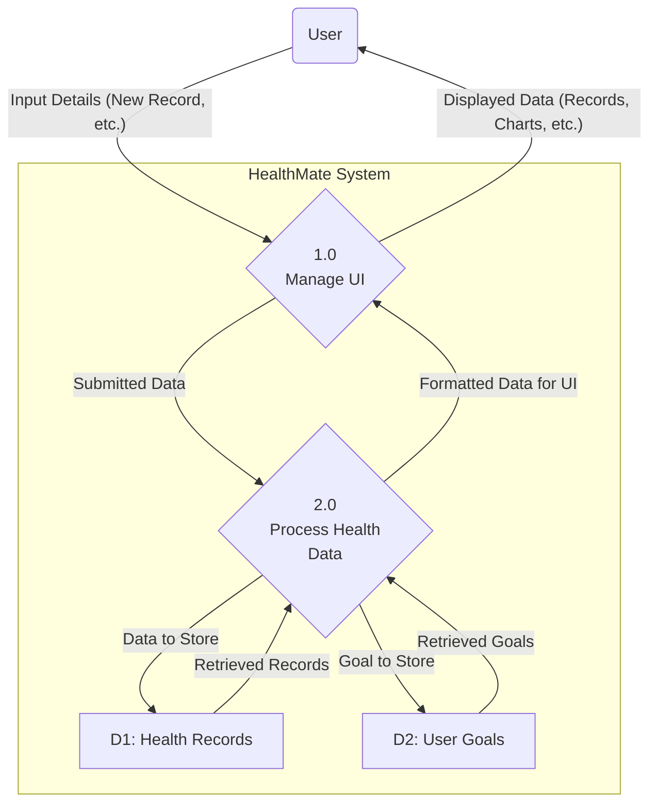
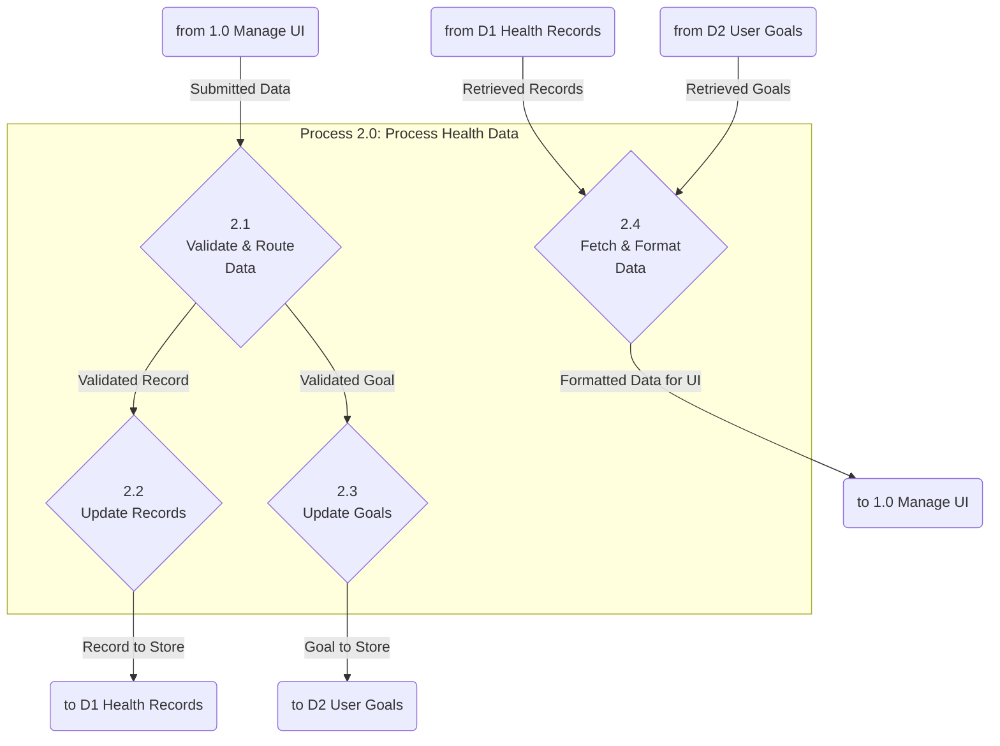

# Technical Report: HealthMate

**Note:** To convert this Markdown file to a PDF, you can use an online tool like [md2pdf.com](https://md2pdf.com/) or a local tool like `pandoc`.

## 1. Project Overview

**Objective:** To create a mobile application that allows users to track and manage their health records.

**Features:**
- User authentication (Login)
- Health record management (CRUD operations)
- Visualization of health data
- Light and dark theme options

## 2. Third-party Libraries Used

| Library | Reason for Use |
| :--- | :--- |
| **provider** | Chosen as the core state management solution. It separates the application's business logic from its UI, allowing the `HealthRecordController` and `ThemeProvider` to manage data and notify the UI of updates in a clean, efficient way. |
| **sqflite** | Used to create and manage a local SQL database on the device. This is essential for persistently storing the user's health records, ensuring data is saved even when the app is closed. |
| **path_provider** | A supporting library for `sqflite`. It is used to find the correct and platform-specific file system path where the local database file can be stored securely. |
| **shared_preferences** | Used for storing simple, non-critical key-value data. In this app, it's a lightweight solution for saving user preferences like daily goals, which doesn't require a full database. |
| **fl_chart** | Selected to provide data visualization. It allows for the creation of clear and interactive charts to display health trends, such as steps taken over a week, which is a core feature of the app. |
| **intl** | Used for date formatting. Since health records are tied to specific dates, this library is crucial for displaying dates in a consistent and user-friendly format according to the user's locale. |
| **image_picker** | Included to allow users to select images from their phone's gallery or camera. This suggests a feature for users to add a profile picture or attach images to their records. |
| **cupertino_icons** | This package is included by default in Flutter projects to provide a set of standard, high-quality icons that match the iOS design language, ensuring a native look and feel on Apple devices. |
| **flutter_launcher_icons** | A development utility used to streamline the process of setting the app's launcher icon. It automatically generates all the necessary icon sizes for both Android and iOS from a single template image. |
| **flutter_lints** | A development tool that enforces standardized code style and identifies potential errors. It helps ensure the codebase is clean, consistent, and maintainable. |

## 3. Architecture & Design

### Folder Structure

```
lib/
├── features/
│   ├── auth/
│   │   ├── services/
│   │   ├── views/
│   │   └── widgets/
│   └── health_records/
│       ├── models/
│       ├── services/
│       ├── viewmodels/
│       └── views/
├── services/
│   └── theme_provider.dart
└── main.dart
```

### State Management

The project uses the **provider** package for state management. The `ChangeNotifierProvider` is used to provide instances of `HealthRecordController` and `ThemeProvider` to the widget tree.

### Database Schema

The application uses a SQLite database to store health records. The database is managed by the `sqflite` package.

**Table: `health_records`**

| Column | Data Type | Description |
|---|---|---|
| id | INTEGER | Primary Key, Auto-increment |
| date | INTEGER | Date of the record (Unix timestamp) |
| steps | INTEGER | Number of steps taken |
| calories | INTEGER | Calories burned |
| water | INTEGER | Water intake in milliliters |
| goalSteps | INTEGER | Daily step goal |
| goalCalories | INTEGER | Daily calorie goal |
| goalWater | INTEGER | Daily water intake goal |

**CRUD Operations:**

The `SqfliteDatabaseService` class provides the following methods for CRUD operations:

- `Future<int> addHealthRecord(HealthRecord record)`: Adds a new health record to the database.
- `Future<List<HealthRecord>> getHealthRecords()`: Retrieves all health records from the database.
- `Future<int> updateHealthRecord(HealthRecord record)`: Updates an existing health record.
- `Future<int> deleteHealthRecord(int id)`: Deletes a health record by its ID.
- `Future<int> getHealthRecordsCount()`: Retrieves the total number of health records.

## 4. Implementation

The core logic of the application is managed by the `HealthRecordController`, which acts as a view model. It interacts with the database service to perform CRUD operations and manages the state of the health records.

### Health Record Controller

The `HealthRecordController` is a `ChangeNotifier` that provides the following functionalities:

- **Initialization:** The `init()` method initializes the database, loads user goals from `SharedPreferences`, and loads the health records from the database. If the database is empty, it populates it with dummy data.
- **Goal Management:** The controller allows setting and retrieving default goals for steps, calories, and water intake. These goals are persisted using `SharedPreferences`.
- **CRUD Operations:** The controller exposes methods to add, update, delete, and retrieve health records. These methods call the corresponding methods in the database service and then notify the listeners to update the UI.
- **State Management:** The controller maintains a list of `HealthRecord` objects and notifies its listeners whenever the data changes. This ensures that the UI is always in sync with the data.

### Database Service

The application uses a factory pattern to get the database service. This allows for easy switching between different database implementations. The `SqfliteDatabaseService` is the concrete implementation that uses the `sqflite` package to store data in a SQLite database.

### Code Snippet (from `HealthRecordController`)

```dart
Future<int> addHealthRecord(HealthRecord record) async {
  // Assign current default goals if not explicitly set in the record
  final recordWithGoals = HealthRecord(
    id: record.id,
    date: record.date,
    steps: record.steps,
    calories: record.calories,
    water: record.water,
    goalSteps: record.goalSteps ?? _defaultGoalSteps,
    goalCalories: record.goalCalories ?? _defaultGoalCalories,
    goalWater: record.goalWater ?? _defaultGoalWater,
  );
  final id = await _databaseService.addHealthRecord(recordWithGoals);
  await _loadHealthRecords(); // Reload and notify
  return id;
}
```

## 5. UI/UX

The application has a simple and intuitive user interface. The main screens are:

- **Login Page:** Allows users to log in to the application.
- **Dashboard Page:** Displays a summary of the user's health data.
- **Add Record Page:** Allows users to add a new health record.
- **Manage Records Page:** Allows users to view, update, and delete their health records.

### Wireframes

**Login Page**

```
+--------------------------------+
|                                |
|          HealthMate            |
|                                |
|  +--------------------------+  |
|  |       Email Address      |  |
|  +--------------------------+  |
|                                |
|  +--------------------------+  |
|  |          Password        |  |
|  +--------------------------+  |
|                                |
|       [   Login   ]            |
|                                |
+--------------------------------+
```

**Dashboard Page**

```
+--------------------------------+
|          Dashboard             |
+--------------------------------+
|                                |
|      +------------------+      |
|      |   Steps Today    |      |
|      |      8,765       |      |
|      +------------------+      |
|                                |
|      +------------------+      |
|      |  Calories Burned |      |
|      |       450        |      |
|      +------------------+      |
|                                |
|      +------------------+      |
|      |   Water Intake   |      |
|      |      1.5 L       |      |
|      +------------------+      |
|                                |
|   [ Add Record ] [ Manage ]   |
+--------------------------------+
```

## 6. Test Cases

| Test Case ID | Description | Steps to Reproduce | Expected Result |
|---|---|---|---|
| TC-001 | Add a new health record | 1. Navigate to the "Add Record" page. <br> 2. Fill in the required fields (steps, calories, water). <br> 3. Tap the "Save" button. | The new record should be displayed in the "Manage Records" page. |
| TC-002 | Search for a record by date | 1. Navigate to the "Manage Records" page. <br> 2. Use the search bar to enter a date. | Only the records matching the entered date should be displayed. |
| TC-003 | Delete a health record | 1. Navigate to the "Manage Records" page. <br> 2. Swipe left on a record to reveal the "Delete" button. <br> 3. Tap the "Delete" button. | The record should be removed from the list. |

## 7. Issues/Errors & Fixes

| Issue ID | Description | Fix |
|---|---|---|
| I-001 | When adding a new record, the goals are not being saved correctly. | The `addHealthRecord` method in `HealthRecordController` was not assigning the default goals to the new record. This was fixed by creating a new `HealthRecord` object with the default goals and passing it to the database service. |
| I-002 | The app crashes when the database is empty. | The `init` method in `HealthRecordController` was not handling the case where the database is empty. This was fixed by adding a check to see if the database is empty and, if so, populating it with dummy data. |
| I-003 | The dark theme is not applied correctly to all screens. | The `darkTheme` in `main.dart` was missing some color definitions. This was fixed by adding the missing color definitions to the `darkTheme`. |

## 8. References

- Flutter.dev. (2023). *State management*. [online] Available at: <https://docs.flutter.dev/data-and-backend/state-mgmt/simple> [Accessed 27 November 2025].
- pub.dev. (2023). *sqflite*. [online] Available at: <https://pub.dev/packages/sqflite> [Accessed 27 November 2025].
- pub.dev. (2023). *provider*. [online] Available at: <https://pub.dev/packages/provider> [Accessed 27 November 2025].

## 9. Architecture Diagram



## 10. Data Flow Diagrams (DFD)

Data Flow Diagrams illustrate how data is processed by a system in terms of inputs and outputs. Here are the diagrams for the HealthMate system, from the highest-level overview down to a more detailed view.

### Context Diagram (Level -1)

The Context Diagram is the most high-level view. It shows the entire system as a single process, highlighting its interaction with external entities.



### Level 0 Diagram

The Level 0 DFD breaks down the single system process from the Context Diagram into its major functional parts. It shows the main processes, the data stores they use, and how data flows between them.



### Level 1 Diagram (for Process 2.0: Process Health Data)

The Level 1 DFD provides a more detailed look into one of the main processes from the Level 0 diagram. Here, we "explode" **Process 2.0: Process Health Data** into its sub-processes.


